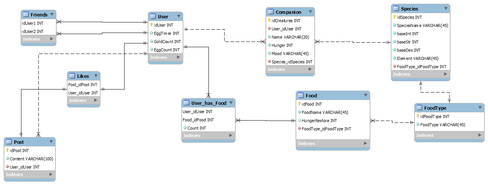

# Cosmini’s <3 #

## Overview ##
With the rise in popularity of metaverses, we are excited to announce our addition to it - Cosmini’s! A social media hub where users socialize and showcase their digital pets. Free from physical limits, users decide what their companion will be like; shapes and forms are checked only by their imagination! This application will allow users to sign in and register themselves. Trade, adopt and perform various activities with your pets. Most importantly, you can showcase your fluffy, scaly or ethereal companions to your friends and gain further resources for growing and expanding your team.

## User Stories ##
* Users should be able to obtain a companion.
* Users should be able to like/comment on content.
* Users should be able to add one another to their friends list.
* Users should be able to view user profiles.
* Users should be able to showcase their companion.
* Users should be able to login using a third party account.

## MVP Goals ##
* User Registration
* User Login
* Portal/Hub
* Liking/Commenting on content
* Posting Content
* Editing profile
* Search/view/add friend
* Resource/Economics system
    * When posting/commenting on posts/being liked/making new friends generates a finite amount of resources
    * In-game marketplace that allows users to trade food/gold/eggs
* Companion interactions
    * Petting
    * Feeding - use your resources to accomplish this
        * Sharing resources with other players and their Companions
            * Companion sale days where people can buy your Companion resources at a discounted rate
    * Conversation based on Companion status
        * Happy, sad, sick, angry, silly, tired....
* Companion Customization/Equipment
    * Stock elemental companions (volcanic, glacial, forest, sky, holy, dark) 
    * Stock attributes for companions for permutation (Str, Dex, Int)
    * Heath, magic points, food, and attack power (these are dependent upon attributes)
    * Creature species name, and also a nickname

## Stretch Goals ##
* Companion adventure/battle
    * Procedurally generated dungeons (easy, medium, hard) that can be run through many times as long as the companion food requirement is met
        * Mostly text-based but a graphic mini map
    * Infinite dungeon where you can try once a day:
        * Async multiplayer via assisting combatants (friends’ main companion)
        * Leaderboard
    * Dungeon rewards include gold(80%), food and gold(15%), eggs(5%)
    * Creature hunger level - depletes with dungeon runs
    * No pvp or co-op at first, but that can be a super stretch goal
* Hunger now influences the companions' combat stats
* In-game shop where you can use gold to buy food or items (mtx)
    * Items can be healing/offensive/or temporary power ups
    * Eventually more eggs or creature parts
* Daily item spinner/reward
* Customization/Theme
* Visual/Audio Feedback
* Teams/Guilds
* Time limited events
* Inter-pet conversation

## Tech Stack ##
* C#
* SQL
* ASP.NET
* ADO.NET
* Azure Cloud Server
* Angular
* HTML
* CSS
* Typescript
* Github Action
* Entity Core Framework
* ORM
* Docker

## Tables ##
* Users
* Posts
* Friends
* Companions
* Likes
* Food
* FoodType
* User_Has_Food
* Species

## ERD ##

